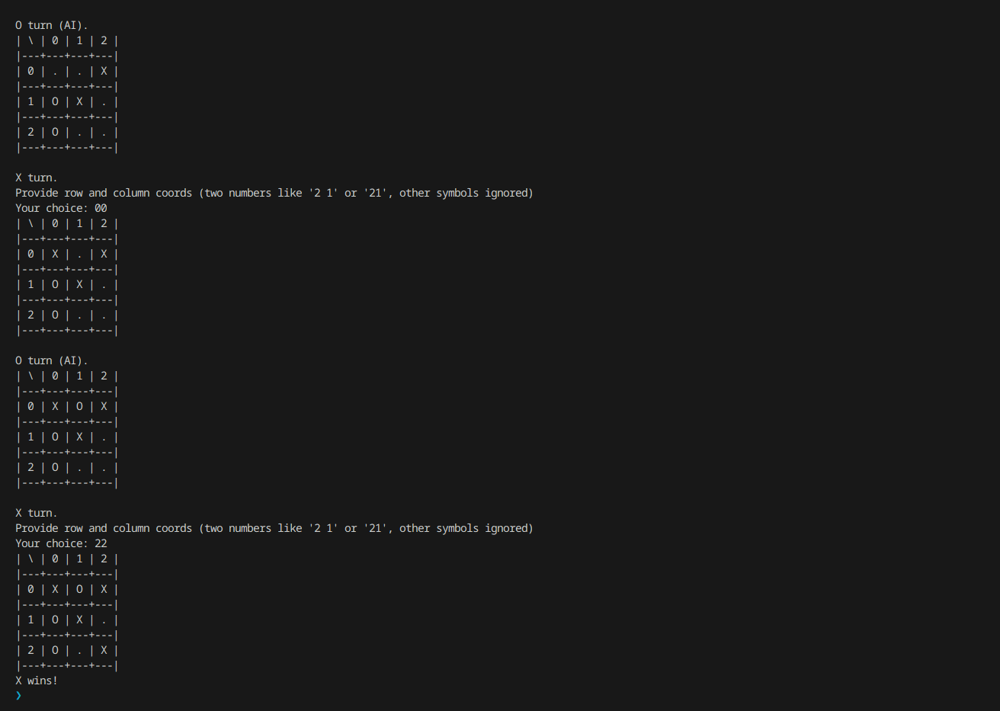

# Tic-Tac-Toe game




[The File](./tic-tac-toe.py)

## Final capabilities

- user mode selection
  - player vs player or player vs ai
  - if vs ai then X/O selection for player
- game loop
- winning combination check
- check if field is already occupied

## Not implemented

Because I am too lazy and this implementation is enough anyway

- AI (currently implemeted as random choice, feel free to replace function with algo of your choice)
- IndexError handling

## Initial implementation plan

(not fully matched)

### What is the flaw?

- init
  - we have 3x3 field (default, may be upgraded in later irerations)
  - we have to select PvP or PvE
  - we have to select Xs or Os
- game loop
  - X or Y turn, check one field
    - input two coordinates if player
    - applying best strategy if computer
  - check if this field was not checked previously
  - check if win combination found, print winner and break the loop if yes

### Functions to prepare

- [x] init_game
  - X or O for player 1, opposite to player 2
  - select if player 2 AI or human
  - draw_field / redraw_field
- [x] do_turn
  - select_best_move
  - input_coords
  - input for player, select_best_move for AI, similar output
- [x] check_winning_combination
  - is current turn win? Print winner then
  - switch X/O and run next loop if not

### The board, object

- redraw, rewriting prevoius state on screen
- check if None on new input and asking to retype
- save state
- board rows and columns should be visually indexed, something like this:

```
| \ | 0 | 1 | 2 |
|---|---|---|---|
| 0 |   |   |   |
|---|---|---|---|
| 1 |   |   |   |
|---|---|---|---|
| 2 |   |   |   |
```